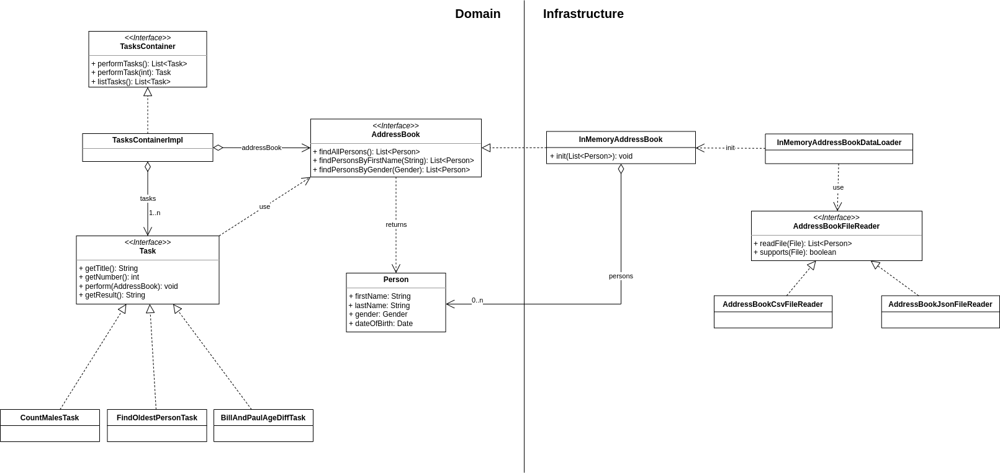

### Reference Documentation

Application reads the attached AddressBook file and answer the following questions:

- How many males are in the address book?
- Who is the oldest person in the address book?
- How many days older is Bill than Paul?

#### Class Diagram


#### Build

With maven run the following:

```
mvn clean package
```

Artifacts are under `address-book/target` directory.

#### Running

From the command-line you can run address book tasks with the following command:

`java -jar address-book.jar --filePath=<file path>`
